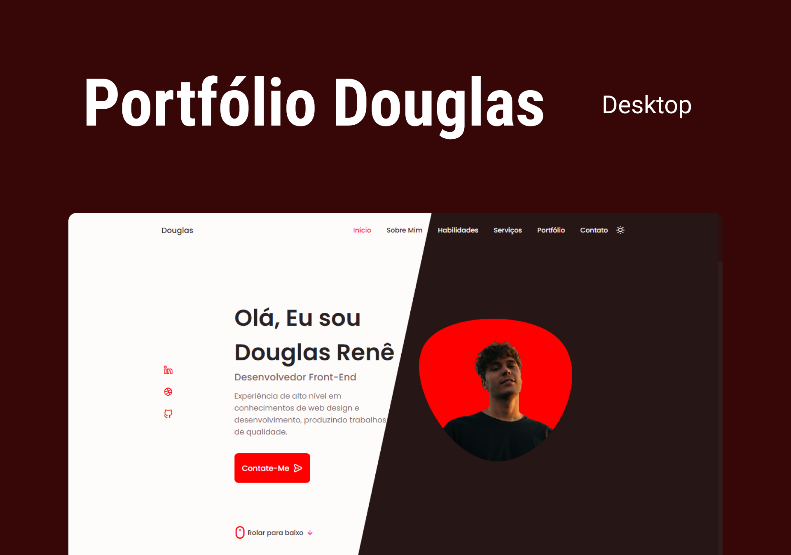

  <a href="#-tecnologias">Tecnologias</a>&nbsp;&nbsp;&nbsp;|&nbsp;&nbsp;&nbsp;
  <a href="#-projeto">Projeto</a>&nbsp;&nbsp;&nbsp;&nbsp;&nbsp;&nbsp;

 

  

## 🚀 Tecnologias

Esse projeto foi desenvolvido com as seguintes tecnologias:

- HTML
- CSS
- JavaScript

Bibliotecas

- [Google Fonts](https://fonts.google.com/)
- [SwipeJS](https://github.com/nolimits4web/Swiper)

Utilitários

- [randomuser.me](https://randomuser.me/photos)
- [IconScout](https://iconscout.com/)

## 💻 Projeto

o Projeto é uma página institucional no formato One Page, responsiva, para usar como Portfólio. Contém as seguintes seções: Header, Navigation, Home, Sobre, Habilidades, Qualificação, Serviços, Portfólio, Projeto, Depoimentos, Contato e Footer

---

Feito como estudo por Daniel Andrade
